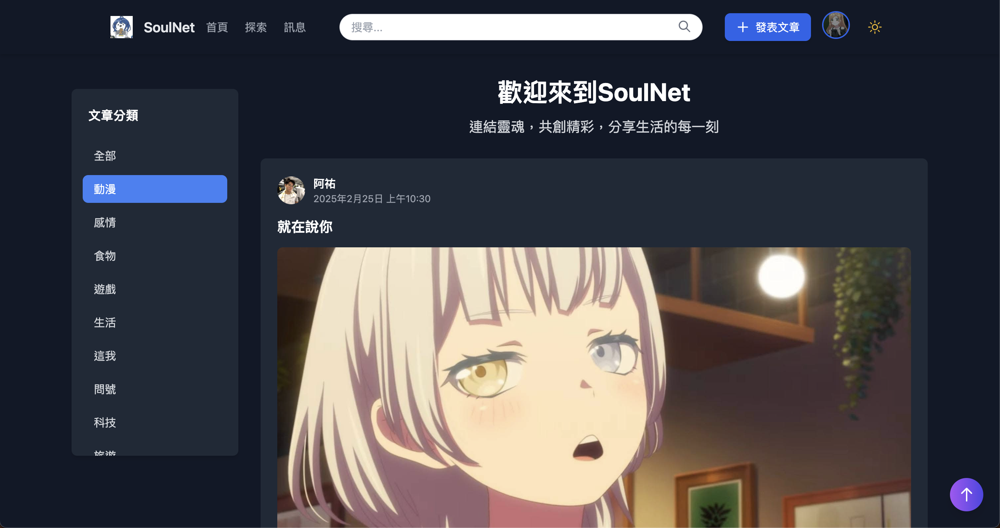
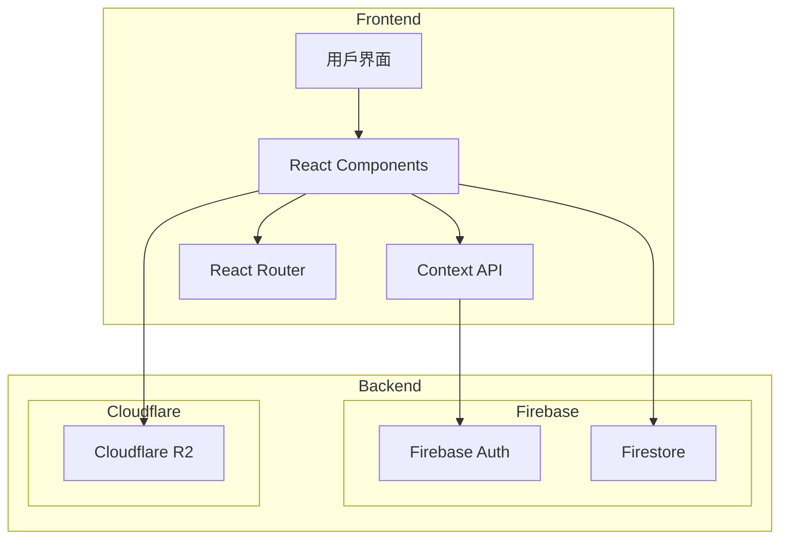
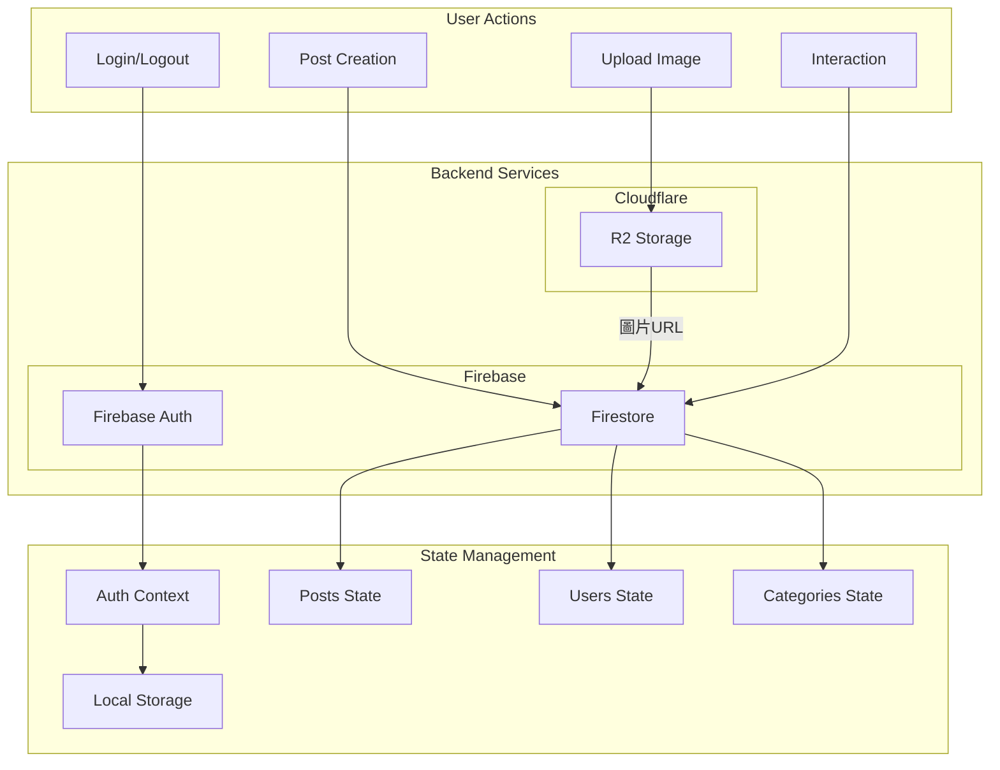
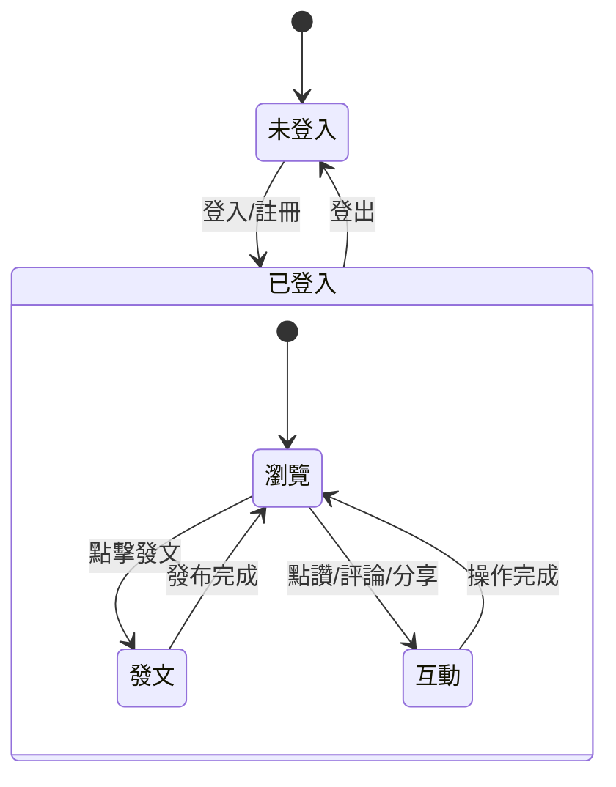

# SoulNet

現代化社交平台，整合文章分享、分類瀏覽與用戶互動功能。這個平台旨在提供一個全面的社交體驗，讓用戶能夠輕鬆發布和閱讀各類文章，通過直觀的分類系統快速找到感興趣的內容，並通過點讚、評論等方式與其他用戶互動。平台的設計注重用戶體驗，採用響應式佈局，確保在各種設備上都能提供流暢的瀏覽體驗。

<!-- 要在 Markdown 中貼上本地圖片，你可以使用相對路徑。假設你的圖片放在與 README.md 同一目錄下的 images 資料夾中： -->


# SoulNet


## 功能特性

### 用戶系統
- **Firebase 身份驗證**：安全可靠的用戶註冊與登入系統
- **個人資料管理**：用戶可以自定義頭像和個人信息
- **本地狀態持久化**：使用 localStorage 保存登入狀態

### 文章系統
- **文章發布**：支持富文本編輯和圖片上傳
- **分類管理**：文章分類系統，支持多分類瀏覽
- **互動功能**：
  - 喜歡：使用心形圖標,支持點擊動畫
  - 評論：優化的評論區設計,支持取消編輯
  - 分享：一鍵複製文章連結
  - 轉發：支持文章轉發功能

### 界面設計
- **響應式設計**：完美適配桌面和移動設備
- **深色模式**：支持淺色/深色主題切換
- **動態過渡**：使用 Framer Motion 實現流暢動畫
- **現代化 UI**：
  - Threads 風格的互動按鈕
  - 漸變色按鈕
  - 優化的評論區佈局
  - 圓角設計和陰影效果

### 用戶體驗
- **即時反饋**：
  - 按鈕點擊動畫效果
  - 評論發布後的過渡動畫
  - 操作提示信息
- **狀態保持**：記住用戶的主題偏好設置
- **無縫導航**：使用 React Router 實現流暢頁面切換
- **評論體驗**：
  - 支持取消編輯
  - 美觀的評論卡片設計
  - 優先顯示用戶郵箱
  - 評論時間本地化顯示

## 系統架構

### 整體架構圖


### 元件關係圖

```mermaid
graph TD
    subgraph Pages
        HP[HomePage]
        PP[PostPage]
        NP[NewPost]
        PF[Profile]
        SG[Sign]
        RG[Register]
        AP[AdminPanel]
        EP[EditPost]
        RP[ResetPassword]
    end
    
    subgraph Components
        PC[PostCard]
        PIB[PostInteractionButtons]
        CS[CategorySidebar]
        IM[ImageModal]
        STB[ScrollToTopButton]
        SM[SuccessMessage]
        HD[Header]
        FT[Footer]
        MM[MobileMenu]
        PH[PostHeader]
        PCN[PostContent]
        PCF[PostCommentForm]
        PCL[PostCommentsList]
        BB[BackButton]
        LS[LoadingState]
        AU[AdminUserManagement]
        AP[AdminPostManagement]
        AH[AdminHeader]
        TS[TabSelector]
    end
    
    subgraph Contexts
        AC[AuthContext]
        TC[ThemeContext]
    end
    
    %% HomePage 關係
    HP --> PC
    HP --> CS
    HP --> IM
    HP --> STB
    HP --> SM
    HP --> PIB
    
    %% PostPage 關係
    PP --> PH
    PP --> PCN
    PP --> PCF
    PP --> PCL
    PP --> PIB
    PP --> IM
    PP --> SM
    PP --> BB
    PP --> STB
    PP --> LS
    
    %% NewPost 關係
    NP --> BB
    NP --> SM
    NP --> LS
    
    %% Profile 關係
    PF --> LS
    PF --> PC
    PF --> STB
    PF --> SM
    PF --> TS
    
    %% Sign 關係
    SG --> SM
    
    %% Register 關係
    RG --> SM
    
    %% AdminPanel 關係
    AP --> AH
    AP --> TS
    AP --> AU
    AP --> AP
    AP --> STB
    AP --> SM
    AP --> LS
    
    %% EditPost 關係
    EP --> BB
    EP --> SM
    EP --> LS
    
    %% 共用元件關係
    PC --> PIB
    
    %% Context 使用關係
    HD --> AC
    HD --> TC
    MM --> AC
    HP --> AC
    PP --> AC
    NP --> AC
    PF --> AC
    SG --> AC
    RG --> AC
    AP --> AC
    EP --> AC
    RP --> AC
```


### 資料流圖


### 狀態管理流程


### 技術棧

### 前端框架
- **React 18**：使用最新的 React 特性
- **Vite**：快速的開發環境和構建工具
- **React Router v6**：聲明式路由管理

### 樣式與動畫
- **Tailwind CSS**：原子化 CSS 框架
- **Material UI**：
  - 優質的圖標系統
  - 表單組件
  - 按鈕組件
- **Framer Motion**：
  - 頁面切換動畫
  - 評論列表動畫
  - 按鈕互動效果

### 狀態管理
- **React Context**：管理全局主題狀態
- **Local Storage**：持久化用戶數據
- **Custom Hooks**：封裝可重用的業務邏輯

### 後端服務
- **Firebase Auth**：處理用戶認證
- **Cloudflare R2**：
  - 圖片和媒體文件存儲
  - 支援大文件上傳
  - 全球 CDN 分發
  - 成本效益優化
- **Firebase Firestore**：
  - 文章數據存儲
  - 評論內嵌存儲
  - 用戶互動數據追蹤

### 開發工具
- **ESLint**：代碼質量控制
- **Prettier**：代碼格式化
- **Git**：版本控制

## 專案結構

```
social/
├── src/
│   ├── components/        # 可重用組件
│   │   ├── HomePage.jsx  # 首頁
│   │   ├── NewPost.jsx   # 發文頁面
│   │   ├── Post.jsx      # 文章詳情頁面
│   │   │   - 文章展示
│   │   │   - 互動功能
│   │   │   - 評論系統
│   │   ├── Sign.jsx      # 登入頁面
│   │   └── Register.jsx  # 註冊頁面
│   ├── contexts/         # Context 相關
│   │   └── themeContext.jsx # 主題 Context
│   ├── utils/            # 工具函數
│   │   └── firebase.js   # Firebase 配置
│   ├── routes.js         # 路由配置
│   └── main.jsx          # 入口文件
├── public/               # 靜態資源
└── package.json          # 項目配置
```

## 安裝與運行

```bash
# 克隆倉庫
git clone https://github.com/yourusername/social-platform.git

# 安裝依賴
npm install

# 開發模式
npm run dev

# 生產構建
npm run build
```

## 環境變量配置

創建 `.env` 文件並配置以下環境變量：

```env
# Firebase 配置
VITE_FIREBASE_API_KEY=你的_API_KEY
VITE_FIREBASE_AUTH_DOMAIN=你的_AUTH_DOMAIN
VITE_FIREBASE_PROJECT_ID=你的_PROJECT_ID
VITE_FIREBASE_MESSAGING_SENDER_ID=你的_MESSAGING_SENDER_ID
VITE_FIREBASE_APP_ID=你的_APP_ID

# Cloudflare R2 配置
VITE_R2_ENDPOINT=你的_R2_ENDPOINT
VITE_R2_ACCESS_KEY_ID=你的_R2_ACCESS_KEY_ID
VITE_R2_SECRET_ACCESS_KEY=你的_R2_SECRET_ACCESS_KEY
VITE_R2_BUCKET_NAME=你的_R2_BUCKET_NAME
```

## 開發計劃

- [ ] 添加文章搜索功能
- [ ] 實現用戶關注系統
- [ ] 添加即時通知功能
- [ ] 優化圖片上傳體驗
- [ ] 添加社交媒體分享功能

## 貢獻指南

1. Fork 本倉庫
2. 創建特性分支 (`git checkout -b feature/AmazingFeature`)
3. 提交更改 (`git commit -m '添加一些特性'`)
4. 推送到分支 (`git push origin feature/AmazingFeature`)
5. 開啟 Pull Request

## 授權協議

本項目採用 MIT 授權協議 - 查看 [LICENSE](LICENSE) 文件了解更多細節.